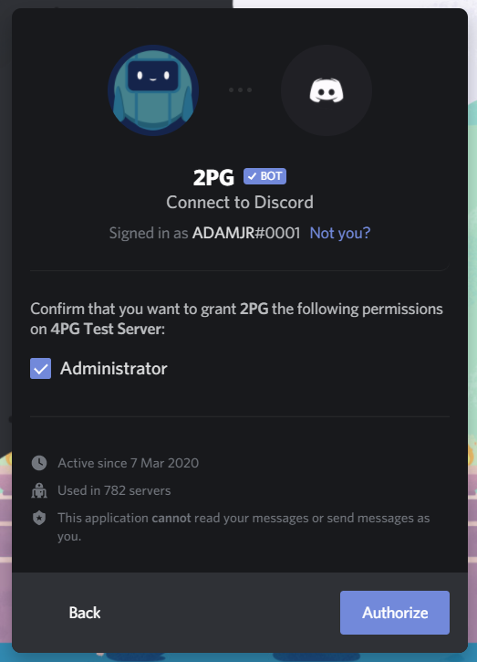

# Get Started

## 1. Invite the Bot

Invite the bot to your server: [https://2pg.xyz/invite](https://2pg.xyz/invite). This will redirect you to a Discord authorization page where you can add the bot.


 Make sure 2PG has **Administrator** permissions or the necessary permissions required, to ensure that all functions work correctly.


### 2. Customize Your Server\(s\)

This can be done at [https://2pg.xyz/dashboard](https://2pg.xyz/dashboard) and clicking on your server, or by [https://2pg.xyz/servers/\[yourServerId](https://2pg.xyz/servers/[yourServerId)\] and replacing `[yourServerId]` with your server ID.

### 3. Use 2PG in Your Server

Type commands with the set prefix \(default: `.`\). Click here for a list of [2PG Commands](https://2pg.xyz/commands).

#### List of Popular Commands

| Usage | Summary |
| :--- | :--- |
| `.help` | Get a list of 2PG commands. |
| `.xp` | Show your XP card for your server. |
| `.play [...query]` | Join a voice channel, and play music. |
| `.ping` | **Pong!** Used for checking if the bot is alive, which it should be. |
| `.clear [count]` | Delete multiple messages in a channel, under 14 days old. |

